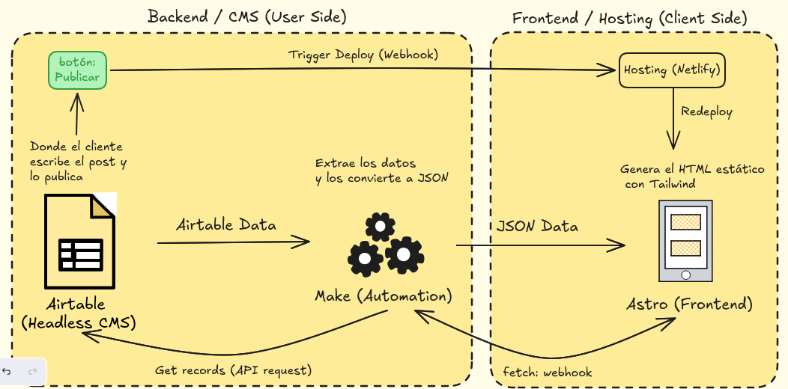
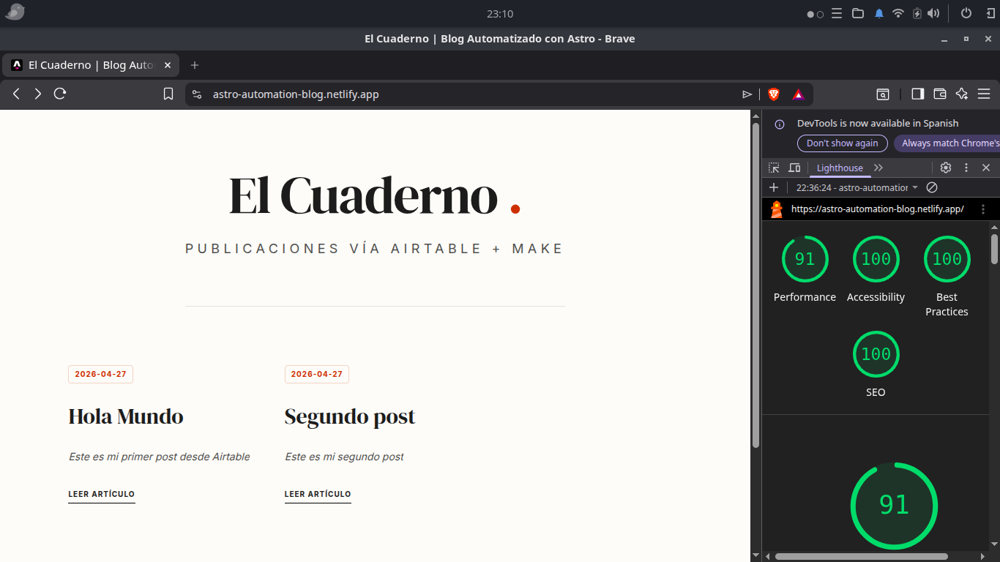

# Arquitectura de Blog Automatizado: Astro, Airtable y Make

Este proyecto presenta una solución para la gestión y publicación de contenidos digitales priorizando la eficiencia, la seguridad y la simplicidad de uso. Se trata de un sistema de blog estático que utiliza una arquitectura desacoplada (Headless CMS) para separar totalmente el panel de gestión de la interfaz pública.

## Puntos clave del proyecto

El desarrollo se centró en resolver tres problemas comunes de los gestores de contenido tradicionales:
1. **Mantenimiento técnico:** Reducción de la complejidad al eliminar bases de datos activas en el servidor.
2. **Rendimiento:** Optimización de los tiempos de carga mediante la generación de sitios estáticos (SSG).
3. **Experiencia de edición:** Uso de una interfaz familiar (Airtable) para la entrada de datos, eliminando la curva de aprendizaje de un panel de administración complejo.

## Arquitectura técnica

El flujo de datos se ha diseñado para ser circular y automatizado:

1. **Gestión de contenidos:** Se utiliza Airtable como origen de datos.
2. **Automatización:** Un escenario en Make actúa como puente, recibiendo peticiones mediante Webhooks y notificando al servicio de hosting.
3. **Generación estática:** Astro consulta los datos en tiempo de compilación para generar archivos HTML puros.
4. **Despliegue:** Netlify aloja la versión final, garantizando una entrega rápida a través de su red global.

## Auditoría de rendimiento (Lighthouse)

Uno de los objetivos principales fue alcanzar la excelencia técnica en las métricas de calidad de Google. Tras un proceso de optimización que incluyó la migración a Tailwind v4 nativo y la implementación de prácticas de accesibilidad y SEO semántico, se han obtenido los siguientes resultados:
  
- **Rendimiento:** 91-100%
- **Accesibilidad:** 100%
- **Buenas prácticas:** 100%
- **SEO:** 100%

## Stack tecnológico utilizado

- **Framework:** Astro
- **Estilos:** Tailwind CSS (v4)
- **Base de datos:** Airtable
- **Integración:** Make.com
- **Infraestructura:** Netlify

## Configuración local

Para replicar este entorno en un equipo local, se requiere:

1. Clonar el repositorio.
2. Instalar las dependencias mediante `npm install`.
3. Configurar un archivo `.env` en la raíz del proyecto con la variable necesaria (se incluye un ejemplo en `.env.example`):
   `MAKE_WEBHOOK_URL=su_url_de_webhook`
4. Ejecutar el comando `npm run dev` para iniciar el servidor de desarrollo.

---
Este proyecto ha sido desarrollado como una prueba de concepto para demostrar las capacidades de las herramientas modernas de automatización y desarrollo web.
